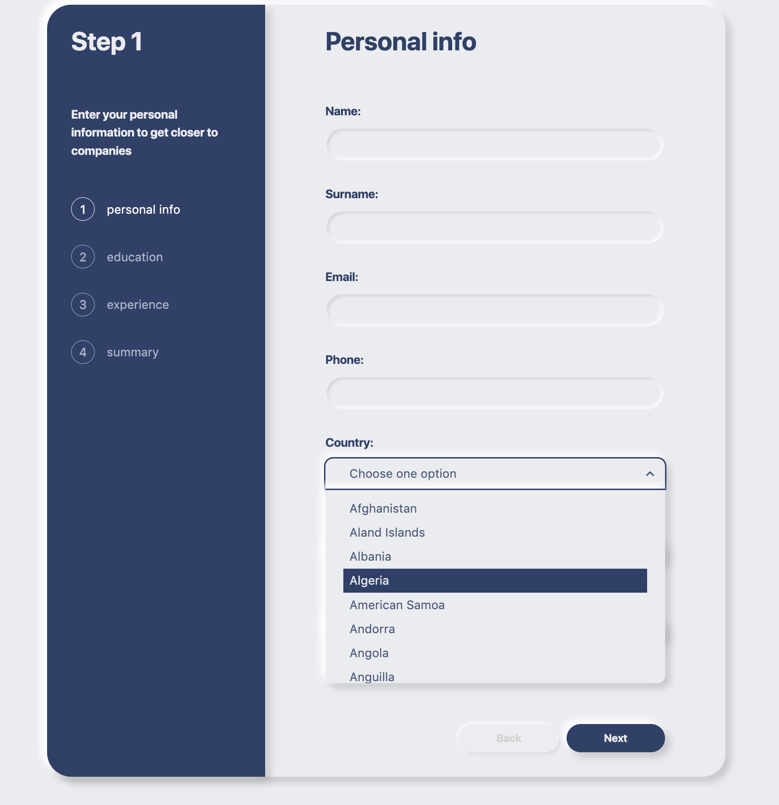

# Multi-page form

See the live version of [Multi-page form](https://yakksiek.github.io/multistep-form/).

The application features a multi-page form interface, styled using Styled-Components and TypeScript. It includes a custom select component, allowing users to navigate through options with keys. Additionally, the app uses a photo file upload system and live form validation.

**Main features**:

1. **Styled-Components**

    - Employs Styled-Components for advanced styling.
    - Enables dynamic theming and modular CSS in JavaScript.

2. **Live Validation**

    - Integrates live validation for form inputs.

3. **Photo File Upload**

4. **Custom Soft UI**

    - Implements a custom Soft UI design.
    - Offers a modern and user-friendly interface with subtle aesthetics.

5. **Use of Reducer in Form**

    - Utilizes a reducer for state management in the form.
    - Enhances form handling, making it more efficient and scalable.

6. **TypeScript Integration**
    - Incorporates TypeScript for static type checking.

&nbsp;

## 💡 Technologies


&nbsp;

## 💿 Installation

The project uses [node](https://nodejs.org/en/) and [npm](https://www.npmjs.com/). After ensuring they are installed, follow these steps:

1. **Install Dependencies**
    - Open your terminal.
    - Navigate to the project's root directory.
    - Type `npm i` to install the necessary packages.

&nbsp;

## 🤔 Solutions provided in the project

**Custom Select** - build from scratch and can be navigated through using keys.

```javascript
function Select({ options, value, data }: Props) {
    const { name, label, error } = data;
    const [listVisible, setListVisible] = useState(false);
    const [highlightedIndex, setHeighlitedIndex] = useState(0);
    const { form, updateState, errors } = useSelectContext();
    const optionRefs = (useRef < Array < HTMLLIElement) | (null >> []);
    const disabled = options.length === 0;

    useEffect(() => {
        if (listVisible) setHeighlitedIndex(0);
    }, [listVisible]);

    useEffect(() => {
        const scrollIntoView = () => {
            if (highlightedIndex >= 0 && optionRefs.current[highlightedIndex]) {
                optionRefs.current[highlightedIndex]?.scrollIntoView({
                    behavior: 'auto',
                    block: 'nearest',
                    inline: 'nearest',
                });
            }
        };

        scrollIntoView();
    }, [highlightedIndex]);

    const resetSelectError = () => {
        const errorInState = errors[name];
        if (!errorInState) return;
        // eslint-disable-next-line @typescript-eslint/no-unused-vars
        const { [name]: ommitedKey, ...rest } = errors;
        updateState('errors', rest);
    };

    const handleStateUpdate = (newValue: string) => {
        resetSelectError();

        if (name === 'country') {
            const newData = { country: newValue, state: '', city: '' };
            updateState('form', { ...form, ...newData });
            updateState('city', []);
            updateState('state', []);
            return;
        }

        updateState('form', { ...form, [name]: newValue });
    };

    const handleKeyDown = (e: React.KeyboardEvent<HTMLDivElement>) => {
        if (disabled) return;

        switch (e.code) {
            case 'Space':
                setListVisible((prevState) => !prevState);
                break;
            case 'ArrowUp':
            case 'ArrowDown':
                if (!listVisible) {
                    setListVisible(true);
                    break;
                }

                // eslint-disable-next-line no-case-declarations
                const newValue = highlightedIndex + (e.code === 'ArrowDown' ? 1 : -1);
                if (newValue >= 0 && newValue < options.length) {
                    setHeighlitedIndex(newValue);
                }
                break;
            case 'Enter':
                handleStateUpdate(options[highlightedIndex].name);
                setListVisible(false);
                break;
            case 'Escape':
                setListVisible(false);
                break;
            default:
                break;
        }
    };

    const handleOver = (index: number) => {
        setHeighlitedIndex(index);
    };

    const handleClick = () => {
        setListVisible((prevState) => !prevState);
    };

    const handleBlur = () => {
        setListVisible(false);
    };

    const selectOption = (e: React.MouseEvent<HTMLElement>, listItem: string) => {
        e.stopPropagation();
        handleStateUpdate(listItem);
        setListVisible(false);
    };

    const optionsJSX = () => {
        const items = options.map((item, index) => {
            const isOver = highlightedIndex === index;

            return (
                <StyledOptionItem
                    key={item.name}
                    ref={(el) => {
                        optionRefs.current[index] = el;
                    }}
                    onMouseOver={() => {
                        handleOver(index);
                    }}
                    isOver={isOver}
                    onClick={(e) => selectOption(e, item.name)}
                >
                    {item.name}
                </StyledOptionItem>
            );
        });

        return items;
    };

    const renderArrow = listVisible ? <UilAngleUp /> : <UilAngleDown />;

    return (
        <Wrapper variant="flex-column">
            <Label>{label}:</Label>
            <StyledCustomSelect
                tabIndex={0}
                onBlur={handleBlur}
                onClick={handleClick}
                onKeyDown={handleKeyDown}
                disabled={disabled}
                isVisible={listVisible}
            >
                <StyledValue>{value || (!disabled && 'Choose one option')}</StyledValue>
                {!disabled && renderArrow}
                <StyledSelectOptions isVisible={listVisible}>{optionsJSX()}</StyledSelectOptions>
            </StyledCustomSelect>
            <FieldError>{error}</FieldError>
        </Wrapper>
    );
}
```

&nbsp;

## 🚀 Future Possible Improvements

Here are some potential enhancements that could be considered for future iterations of the application:

1. **Refactor Country/City/State Mechanism**

    - Evaluate and potentially replace the current external library and use API calls to improve performance.

2. **Mobile View Optimization**

    - Implementing a fully responsive mobile view will ensure accessibility and usability across all devices.

3. **Component Decoupling**
    - Move the core logic away from the `App` component. This may include using additional hooks, context providers, or higher-order components.

## 🙋‍♂️ Feel free to contact me

Write sth nice ;) Find me on [LinkedIn ](https://www.linkedin.com/in/marcin-kulbicki-426817a4/) or [Instagram](https://www.instagram.com/yakksiek/)

&nbsp;

## 👏 Credits

Thanks to my [Mentor - devmentor.pl](https://devmentor.pl/) – for providing me with this task and for code review.
